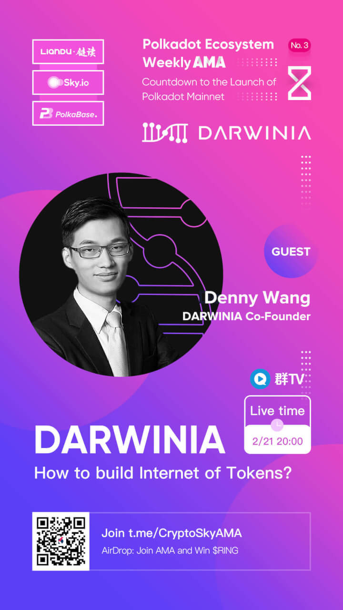
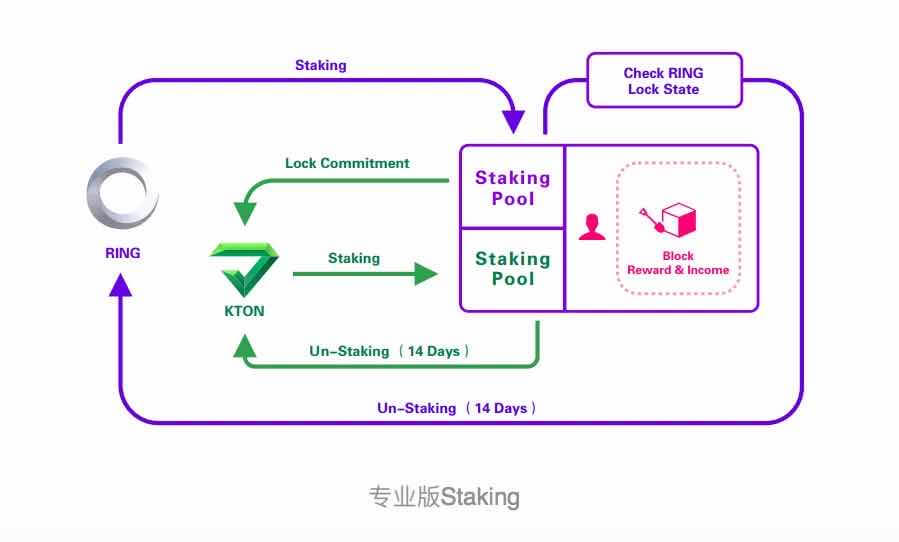
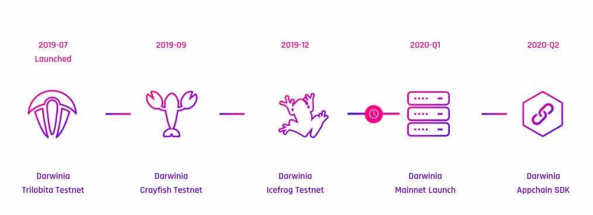

Ladies and gentlemen, great to have you all here! This time, we have brought together the two-month Polkadot Ecosystem Project AMA series, which has been launched to the 3rd AMA.

<!--truncate-->

We have invited the Polkadot Ecosystem “Darwinia Network” project. Darwinia Network, Web3 Foundation Grant Project, Cross-Chain Application Hub and Asset Interconnection Network.

We invited Denny Wang, co-founder of “Darwinia Network”, to talk about “How to build the Internet of assets? Denny will explain the ecosystem members, staking mechanism and project progress of Darwinia Network.

Great to have you here, so let’s start our AMA today ~

**1.Briefly introduce the Darwinia Network. What kind of problem does it mainly want to solve, and what is the main application direction?**

Darwinia is mostly a cross-chain application hub and asset interconnection network developed based on Substrate. It provides mostly application interoperability and asset cross-chain functions for blockchain applications. At present, the business directions mainly include on-chain services of NFT and cross-chain NFT markets, cross-chain token bridges of stablecoins, and cross-chain Token Dex protocol.

There are already some projects planned to use Darwinia’s application cross-chain services, including the open blockchain game Evolution Land, as well as DAI payment appchain, NFT on-chain service, NFT cross-chain auction market, etc. These projects will become the important early members of our Darwinia ecosystem.

**2.Both of two co-founders of Darwinia are early core members of Bitshares. Can you tell us some of your experiences behind?**

Since about 2012, our two Co-Founders have started to contact and understand the crypto community. Bitshares is one of the critical and interesting projects. Some of the concepts of decentralized exchange and stablecoins were first proposed. It’s application made great development and landing today. Bitshares is an open-source project that we are deeply involved in. I personally also participated in the core development of Bitshares 1.0. Of course, we are always open-minded, and have paid attention to and participated in the entire crypto ecosystem and other projects, such as Ethereum, MakerDAO, NEO, etc.

And then till 2018, we established Itering in Singapore (https://www.itering.io/), which is now the developer of Darwinia open source software and the primary development team of Darwinia.

**3.I read that Darwinia had just received funding from Web3 Foundation a week ago. Why did your team choose to join the Polkadot Ecosystem? Nowadays more and more teams are turning to the Substrate / Polkadot ecosystem. Because of that, What are the attractions of Polkadot? Any obstacles you met on developing based on Polkadot?**

Earlier, I have paid great passion for Ethereum, so I was always interested in the work done by Gavin Wood and Parity. Why I finally decided to join the Polkadot ecosystem. I think it is because of Substrate, we all know that Substrate is a framework for developing blockchains, and the advantage of Rustlang. Substrate’s main implementation language is Rust. Around the beginning of 2019, when we examined some cutting-edge blockchain engineering technologies, we also studied Substrate in-depth and found that the design of this framework is very forward-looking in many aspects. Including the modular design, runtime environment, etc, plus the previous great impression to Parity Technologies we felt, so I probably have a feeling that the application chain based on Substrate should really have a vigorous development in the future.

Also, the Substrate framework has a high degree of matching with our team. Our team, Itering, has been committed to the large-scale implementation of blockchain applications. The technical solutions for research and development are mainly aimed at the “application landing”, including the cross-chain technology “Darwinia Relay”, Distributed Key Management Service DKMS, on-chain random numbers, NFT identifiability, etc. As you know, at the same time, the blockchain network is a complex network system that requires strong underlying support and security guarantees. It is impossible to deal with this problem without an extensive open source community and reliable partners. Therefore, After more than a year of use and learning, we think that Substrate is an excellent core of a blockchain framework. Interestingly, our team is also a fan of Rustlang.

On the other hand, blockchain projects and the open-source frameworks everyone promote sometimes have problems with their development focus. I hope that Polkadot and Substrate can circumvent this pit that Graphene has encountered, so that the Substrate framework can benefit the entire industry for a long time. However, I think it’s a pity that because Graphene has not been continuously supported and maintained, it has not been able to develop rapidly in the blockchain open-source community since then, and some designs have not been updated. Its development has now become a bit stagnant.
Back to the topic, at present, in a short period time, we expect that Substrate 2.0 can be stabilized and can be put into production as soon as possible. At the same time, as a developer, I also agree that “It ‘ll be done when it’s done”.

In addition to Substrate, Polkadot has many other designs that are very attractive to us, including cross-chain architecture, parachain design of shared security pool, SPREE module, Web Assembly technology, etc. These technologies can create truly trust-free chain network, not just to establish a message communication mechanism between blockchains.

**4.Thank you, very detailed, I see a full recognition of the Substrate / Polkadot ecosystem. Since DARWINIA is part of the Polkadot ecosystem, what do you think is unique about DARWINIA in this ecosystem?**

In my understanding, Polkadot is committed to building a cross-chain backbone network, and Darwinia has more application-oriented and the number of interconnected assets.

Therefore, Darwinia can rely on these applications and assets to help Polkadot ecosystem to create more landed applications and let common users can indirectly enjoy the convenience of Polkadot cross-chain tech as soon as possible.

**5.As the first game chain of the Polkadot ecosystem, what cross-chain businesses are available for games and application chains?**

Darwinia is the earliest member of the Polkadot ecosystem to conduct business in the game direction. Itering has developed a blockchain game Evolution Land (https://www.evolution.land/), which has launched on Ethereum and Tron, with a further plan of developing game application chain and Evolution Land plan to become a sub-chain of Darwinia. The technical difficulty of the above direction is mainly how to develop a consensus algorithm suitable for Substrate with high concurrency and fast block production speed. We are already conducting related research. I believe that you all can see the solution soon.

Besides, Darwinia also considers cross-chain NFT assets as the highest priority business development direction. Game assets are undoubtedly the most crucial category of NFT assets and will help us obtain many game player users. By taking advantage of cross-chain and connectivity, it is relatively convenient and practical to build a cross-chain NFT trading market. At the same time, Darwinia, as a cross-chain application hub and asset connection network, provides universal cross-chain and connection services. The game business is only a part of the Darwinia application ecosystem, and many other businesses can take root. Definitely, Defi has developed rapidly, and the applications are relatively landing. Many opportunities can be tapped. We plan to cooperate and explore in this direction.

**6.Great, so the gaming business is a part of the Darwinia applications. Darwinia may be the first Polkadot ecosystem project using Dual Tokens. Why should you use dual tokens? What are the advantages?**

Great question. Although Darwinia has two tokens, RING and KTON, they are not a reciprocal relationship, but a primary and secondary relationship. KTON is essentially a derivative of RING. It is obtained by promising to lock RING for some time during the staking process. Therefore, RING is the native token.

RING is the native asset of the Darwinia Network and is the basic token that serves as a payment token and a fuel token. Fuel costs include transaction costs, contract execution costs, network bandwidth costs, and storage costs.

KTON is obtained by users actively locking RING. The initial supply is 0. Users can choose to lock RING for 3 to 36 months. Why we set Dual? The essence of KTON is to make up for the loss of liquidity for users who promise to lock RING for a long time. KTON itself can be traded and transferred. KTON, the promise to lock tokens, is a manifestation of Commitment tokenization, which can only be obtained by locking RING. We have some different understandings of Proof of Staking. Many traditional POSs are based on the design of a currency age.However, we don’t think this is the best caliber to measure the evidence of stake workload. We believe the best caliber is based on Commitment, which means how long you promise to hold this currency in the future. Based on this, we have some different designs. KTON is designed based on this consideration, and KTON and RING can also participate in Staking.

**7.Great explanations. How do we stake in the dual token system, and what is this kind of staking mechanism?**

Ok, let me share a picture first, so that everyone might understand…

In Darwinia, both RING and KTON can participate in Staking, and KTON is locked when participating in Staking through RING, so Staking will be slightly more complicated than other Staking systems.

Inside the system, in order to more accurately identify the contribution ratio of RING and KTON to Staking, we have introduced the concept of computing power in a similar POW system to represent the contribution of two tokens to Staking. In the default setting, the amount of hash power contributed by all RINGs and all KTONs is the same, and the computing power of each user is calculated by the proportion of tokens participating in staking to all staking tokens.

Then back to the economic model, users holding both RING and KTON can perform staking, and they can get benefits. After starting Staking, you can get income. After lifting Staking, it takes 14 days for RING and KTON to arrive.

The sum of the total number of Staking available to all users is the total annual inflation of the Darwin Network. The total revenue generated by Staking is initially distributed to all customers who use RING to Staking and KTON to Staking in a 1: 1 ratio. That is to say, if the number of KTONs in the initial period is small, the users of Staking KTON will get a lot of benefits. Both RING and KTON holders can participate in community governance. In the future, the plug of the sub-chain into the Darwinia network will also need to obtain slots through RING. There can be more analysis of the staking mechanism, that’s all today, welcome to quiz me.

**8.What partners does DARWINIA currently ride with?**

Polkadot is our most important partner. Specifically, it includes a series of cooperation with Web3 Foundation and Parity. We have been actively participating in the construction of Polkadot ecosystem, including participating in some online and offline activities. Recently, we have also won W3F Grant.

Other partners include MakerDAO, Math Wallet, imToken, BiHu, many staking node operators, etc. The joining of these partners has helped Darwinia enrich its own ecosystem. In the future, we have more partners to join, including many already announced and unannounced.

**9.So, Is there any further cooperation with MakerDAO? What are your thoughts on Defi?**

Last year we announced that we would cooperate with MakerDAO. Darwinia will build a stable coin DAI cross-chain transfer bridge and develop a payment application chain based on Substrate. DAI will become the first stable coin supported by its cross-chain transfer bridge. The stablecoin DAI will be able to cross-chain to the Polkadot parachain and Darwinia application chain through the Darwinia network.

DAI’s cross-chain transition bridge will allow users to use the Darwinia network as a transition bridge to transfer tokens between the Ethereum network and the Darwinia network. For example, DAI as an ERC20-based stablecoin can be entered from the Ethereum transition bridge contract and transferred to Darwinia network, access to other parachains of Polkadot, or Darwinia payment application chain.

Darwinia is working on a high-performance, high-TPS application chain payment solution to better enable users to use stablecoins for on-chain payments. Through such infrastructure improvements, there will be opportunities to reduce the threshold for game users to apply payments. By using stablecoins instead of high-volatility native currencies, it will help increase penetration. Users will be able to use stablecoin DAI to purchase game items and assets. Promoting the large-scale use of blockchain technology in the game industry has always been one of the main visions of the Darwinia network. At present, the blockchain game industry still faces many user experience challenges and infrastructure thresholds. The stablecoin payment network is one of the critical aspects. Cross-chain Bridge technology and Substrate technology are fundamental new technologies suitable for improving infrastructure.

At present, we are exploring the specific Token Bridge scheme. After the scheme is determined, the final step is to implement the scheme and develop it.

Speaking of DeFi, we think that Defi is one of the essential forms of the open financial movement and has very good composability. The trending FlashLoan recently talked about has the power to reflect the composability of contracts. Therefore, Darwinia will focus on the combination and connection of existing assets rather than re-creating new assets, which is also in line with our vision as a cross-chain application hub and asset Internet. At present, we have planned to launch Defi business directions including many examples in this regard, including DAI cross-chain transfer bridges and payment application chains, Uniswap-like asset exchange agreements, NFT trading markets, and so on to be an embodiment. We are very much welcome the cooperation of Defi assets and applications on various public chains with us. Our cross-chain technology will help any project in need to reach a broader market.

**10.Darwinia previously released Darwinia ETH-Relay (cross-chain transfer bridge). What is the difference between this solution and other existing solutions? What are the technological innovation points?**

The ETH-relay Module that has been released is an advanced proof-of-concept version of the Darwinia Relay system. At present, cross-chain solutions in the industry are mainly divided into two types, homogeneous chain cross-chain: For example, each parallel chain of the Polkadot system is developed using Substrate and shares the pool of validators. It is relatively easy; and the solution of heterogeneous chain cross-chain is basically similar to the way of alliance trust. It introduces mechanisms such as multi-signature and pledge to maintain the security of cross-chain assets by trusting a group of trustees.

When looking back at the history of cross-chain transfer bridges, the previous open-source was the BTC Relay developed by Consensys, which is a one-way bridge from BTC to ETH. The BTC SPV client is used to verify transactions on BTC by using Ethereum smart contracts. In addition, there is the WaterLoo EOS-ETH bidirectional transfer bridge developed by Kyber Network, which implements the light node of the opponent chain on ETH and EOS respectively, but because the smart contract has a relatively high running cost, WaterLoo still does some verification logic for Ethash Compromise, not completely decentralized.

This time, Darwinia’s open-source eth-relay module was developed and implemented using Substrate. Compared with smart contracts, the Substrate runtime module provides more flexibility, especially in terms of fuel costs and operating costs. It can be optimized a lot, ensuring It can also provide better economic feasibility based on complete decentralization.

The ETH-relay module is an ETH-Darwinia one-way bridge. It is implemented by developing an Ethereum Light Client in Darwinia. Recently, Darwinia will also release Darwinia Relay, the latest research result of the bridge.

Darwinia Relay is a super-light client-based solution. Learning from the failure experience of early BTC Relay, it can solve the problems of performance and economic feasibility. It introduces technologies such as Merkle Mountain Range (MMR) commitment, Optimistic Verification Game, Super Light Client framework, Relay incentive model, etc. to achieve fact-based and without trusting any center Or semi-centralized entities. In addition, by using Darwinia as a relay, a bridge with external chains is built, so that assets can freely move around in various heterogeneous blockchain networks.

Currently, the design of Darwinia Relay is undergoing an internal review, and the detailed plan will be released after the review.

**11.Last but not least, What is the current progress of the project, when will it be officially launched, and the development route plan?**

Since July last year, we have successively released three test networks. The latest test network is Icefrog. You can view the data of this test network in the Subscan browser (https://subscan.io/) https://icefrog.subscan.io/

At present, most of the functions have been developed, but more security audits and tests are needed.Also, we are also waiting for Substrate to stabilize. In the end, the mainnet launch time should be slightly later than the Polkadot mainnet. The probability is relatively high in March and April. Before the mainnet goes live, we will also release our last test network. We hope that this test network will run for a long time, even after the mainnet goes live, for developers to test.

This our Roadmap.

For more information, visit Darwinia’s official website: https://darwinia.network/

Also, we are currently hiring for Rustlang development. Interested partners can contact us at hello@darwinia.network

That’s all, Appreciate you all !
