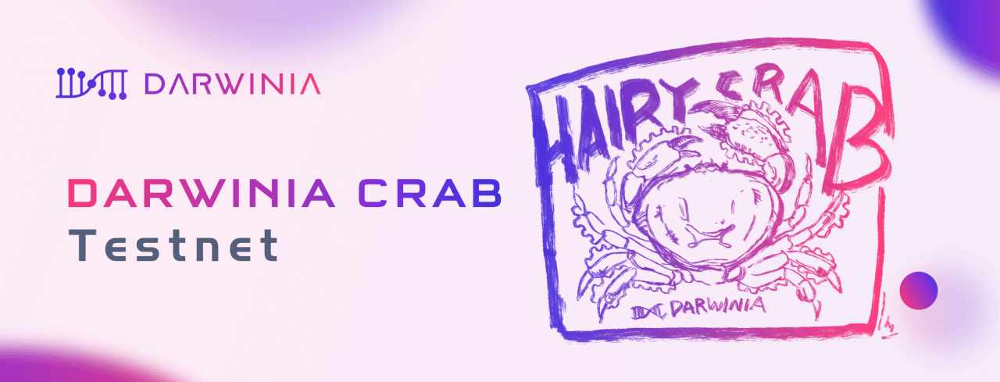

**Darwinia Crab Testnet (PoC-4) is coming!**

Darwinia Crab Testnet (Crab for short) is the last testnet before Darwinia Mainnet launched, a Canary Network of Darwinia, which provides simulation and test environment for Darwinia’s upgrade and application deployment. The test environment includes not only the software operation environment and network environment required for testing, but also the test economic environment.

<!--truncate-->

**For Crab, it is essential to understand the following:**

1. The positioning of Crab is similar to Polkadot’s Kusama Network. Expect Chaos is a reasonable expectation.

2. Crab will be designed as a long-term testnet, but it cannot be ruled out that it will stop running due to unexpected conditions or failures.

3. Crab is a testnet. Its purpose is mainly to test and perform various radical experiments. Therefore, the tokens and assets running on it have no other value than the experimental and test value.

4. Crab’s tokens are CRING and CKTON, with the same parameters as Darwinia Mainnet, and use the same Staking mechanism and inflation model. The initial supply of CRING is 2000M, and the supply of CKTON is 0.

**For Crab to simulate the real economic environment to a certain extent, Darwinia will plan:**

1. Holders of the current RING (ERC-20 and TRC-20 RING, including the deposit certificate part) will get CRING (AirDrop) for free, the ratio is 1 RING = 1 CRING.

2. DARWINIA will randomly select the snapshot time and block height during March 3–10, 2020, and announce the results after the snapshot, and airdrop accordingly. The airdrop distribution method is collected by the user after the Crab Testnet launched. This time, AirDrop is not targeted at KTON holders.

3. After the Darwinia Mainnet launched, a Token Bridge will be built between Darwinia Mainnet and Crab, allowing CRING and RING to be mutually exchangeable in the long term, with a conversion ratio of 1 RING = 100 CRING.

4. Darawinia will reserve 40M RING as the backed asset of CRING for the Cryptocurrency Backed Asset Model(CBA Model).

5. Other plans include building Faucet, providing free CRING to developers who need them for testing, and testing the Eth-relay Module, etc.

**Starting from July last year, DARWINIA has successively launched three testnet. At present, the main functions have been developed and more security audits and tests are in progress. Darwinia Testnet Historical Version:**

Daiwinia PoC-1 Testnet: Trilobita (2019–07)
Daiwinia PoC-2 Testnet: CrayFish (2019–09)
Daiwinia PoC-3 Testnet: IceFrog (2019–12)
