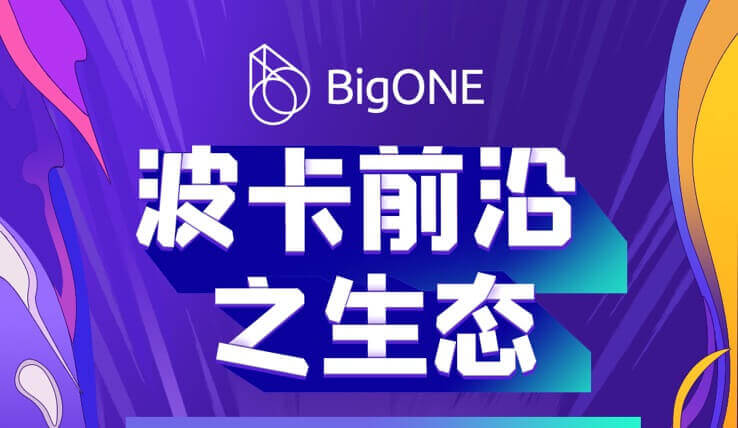

波卡是自17年创立以来在圈子里热度就不曾下降的项目，近期波卡主网准备上线的消息也在社群中广为流传。今天BigONE就为大家邀请来了Darwinia Co-Founder Alex Chien。

<!--truncate-->

**主持人：**欢迎Alex做客来做客本次主题为《波卡前沿之生态》的线上AMA直播，那接下来大家也跟社群朋友们打个招呼吧

**Alex：** 主持人好，各位嘉宾好，大家好，我是达尔文网络（Darwinia Network）联合创始人Alex。达尔文网络是基于Substrate开发的跨链桥接网络。

大概从2012年开始，我和另外一位Co-Founder Denny就已经开始接触和加入加密社区，Darwinia现在的核心成员一部分都来自Bitshares（比特股）团队，Bitshares也是我们当时参与比较深的一个开源项目，Denny还曾经是Bitshares 1.0的核心开发，当然我们一直保持开放心态，对整个加密生态和其他项目也有不同程度的关注和参与，例如Ethereum, MakerDAO, NEO等等。

大概2018年的时候，我们成立了Itering新加坡公司(https://www.itering.io/)，现在是Darwinia开源软件的开发商，也是Darwinia的主要开发团队。

### Q1：Darwinia社区目前也是波卡生态项目中最活跃的社区之一，Alex Chien 来为大家说一说Darwinia是一个怎样的项目吧？

**Alex：**我刚才做自我介绍的时候也提到了，达尔文网络是基于Substrate开发的跨链桥接网络，主要专注于建设资产互联网络，侧重在非标资产跨链拍卖市场，稳定币的跨链，资产交易兑换等领域。

目前已经有一些项目计划使用Darwinia的应用跨链服务，包括开放区块链游戏Evolution Land，还有DAI支付应用链，NFT上链服务，NFT跨链拍卖市场等等，这些项目都将成为Darwinia早期生态的重要成员。

跨链互操作是一个重要课题，对整个加密圈都是至关重要的，各路神仙各展所长，有各种各样的解决思路和方案，各有优缺点，大家都在为了实现这个目标做出贡献。

Darwinia 的跨链转接桥则是基于轻客户端的解决方案。吸取了早期BTCRelay失败的经验，我们提出了超级轻客户端的概念和解决方案，实现了基于事实的去中心化且无需信任任何中心或半中心化实体、联盟的异构链跨链转接桥。搭建与外部链之间的多个桥，通过Darwinia为中继，使得资产可以自由得在各个异构区块链网络中流转移动，波卡生态中的各条链作为其中的一个顶点，也可以获得这样的能力。

先前我们已经发布了Darwinia Bridge体系的一个先行概念验证版本：Darwinia-ETH Bridge。本质上是PoW共识到NPoS共识相互的超级轻客户端。Darwinia开源的 ETH-Darwinia Bridge模块是使用Subtrate开发和实现的，相对于智能合约，Substrate运行时模块提供更多的灵活性，特别是在燃料费和运行成本方便可以做很多优化，在保证完全去中心化的基础上还可以提供更好的经济可行性。

### Q2：对于绝大多数圈内人来讲，波卡的技术逻辑是有些晦涩难懂，作为波卡的生态项目，Darwinia有遇到这类问题吗，能具体谈一谈怎么解决的吗？

**Alex：**我们决定加入波卡生态，最早是因为有关注以太坊，所以对Dr. Gavin Wood和Parity做的工作也一直比较感兴趣。波卡的技术逻辑难懂，恐怕是因为太快切入细节，被庞大的体系给淹没了。其实如果理解了波卡诞生的使命，了解全貌后通过一条主线去贯穿理解各个部分那就显得一切都合情合理了。过去和Dr. Gavin Wood有过很多次交流，所以我想我大概能讲明白这个问题吧。

波卡诞生的初衷是想让各个链各司所职，专注自己的业务特点去设定各种参数，实现自己的个性，但是又能保持一定共性，使得安全性、互操作性能有保证，价值在链接可以自由流动。沿着这个思路下去，就有了让大家能够快速开发链的业务逻辑，不必重复发明轮子，把过往的经验抽象提炼出来变成一个比较容易使用的开发工具，开发者可以迅速搞定底层的各种功能，比如p2p协议，共识算法等等，而又可以通过各种功能模块或者叫组件库可以快速拼搭，按需使用。这样就可以有更多精力注重在自己要解决的业务功能上。这就是substrate这套工具组诞生的原因。而Polkadot本身则作为一个relay chain把这些应用链联系起来，让他们可以共享安全池，消息可以互通。

大画面看清楚了，剩下的就是细节问题的理解了。

我们也参与开发和使用过其他的一些区块链开源框架，例如Bitshares所使用的Graphene框架。相比之下，发现substrate这个框架的设计在很多方面是非常具有前瞻性的，包括模块化设计，运行时环境等等。Substrate框架跟我们团队的匹配度很高，适合快速迭代的要求。我们的团队Itering一直致力于区块链应用的大规模落地，因此研究和开发的技术方案主要针对应用落地这个方向，包括跨链技术Darwinia Relay，分布式秘钥管理服务DKMS，链上随机数，NFT可识别性等等，同时，区块链网络又是一个复杂的网络系统，需要有很坚强的底层支撑和安全保障，应对这个问题离不开广泛的开源社区帮助和强有力的合作伙伴。通过一年多的使用与学习，我们认为Substrate是非常有棒的一个区块链框架内核，有意思的是，我们的团队也被其主要实现语言Rust圈粉。

当然，过程中还是有一些挑战的，我想主要原因是substrate这套工具本身就在快速演进中，所以要跟上节奏需要花费不少精力。我们积极参与社区讨论和建设，也加入了Substrate Builders Program和Web3.0 Bootcamp，与Parity的开发者保持紧密沟通。我们开发的Ruby实现的substrate底层codec项目scale也获得了web3 grant。我们通过这些方法来紧跟开发的节奏。

我们期待Substrate 2.0可以尽快稳定下来，可以早日投入生产环境，同时，作为开发者我也认同 It’ll be done when it’s done.

### Q3：您认为Darwinia会在波卡生态中承担哪种角色？

按照我的理解，Polkadot致力于打造一个跨链的中继网络，在共享安全验证人池的情况下，价值符号可以容易地跨链传递和交互，好比是大家说差不多的方言，沟通就没什么问题；而Darwinia创新性的提出了去中心化背书技术和去中心化桥接技术，侧重在异构链之间搭建中继桥，帮助波卡生态中的链方便地与外面的世界进行沟通互联，好比是和外乡人或者外国人沟通的忠实的翻译。

接入外部的丰富资产以及各种协议，Darwinia将可以依托这些应用和资产帮助Polkadot生态打造更丰富的落地应用和相互连接的资产互联网。

这是我们希望能给波卡以及波卡生态内的项目带来的价值。

波卡生态不同其他网络生态，特别强的一点是各个项目有一定的同源性，举个例子，比如我们的账户公私钥体系是一样的，某个用户因为Darwinia创建了一个Account，实际上他也等于在Acala或者ChainX上有了账户，虽然显示的地址是不同的，但是是通过同一个私钥进行控制的，那么实际上每个项目都是可以共享用户，用户也可以无缝在链间穿梭，大大降低了进入的摩擦阻碍。同时每条链实现的能力同样可以惠及其他生态项目。

所以，让我们一起努力，打造一个丰富多彩的波卡生态。