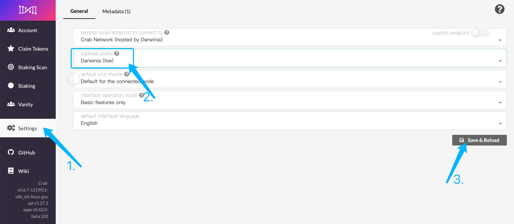
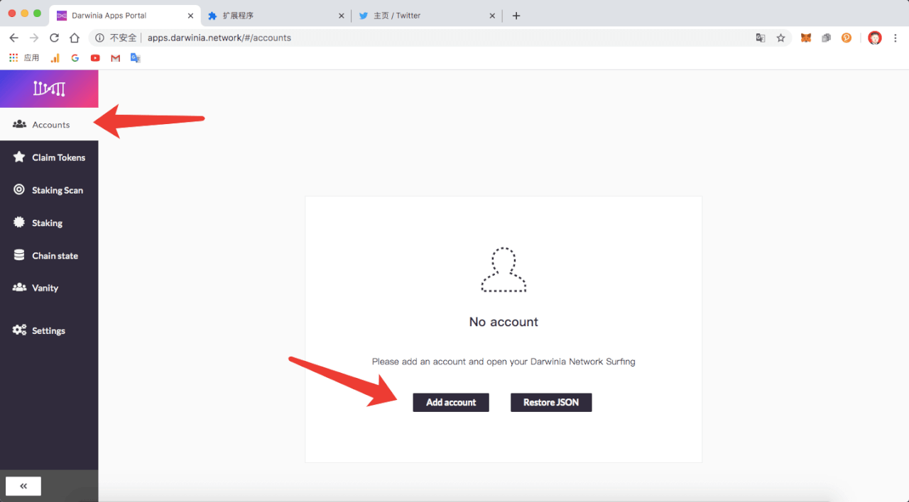
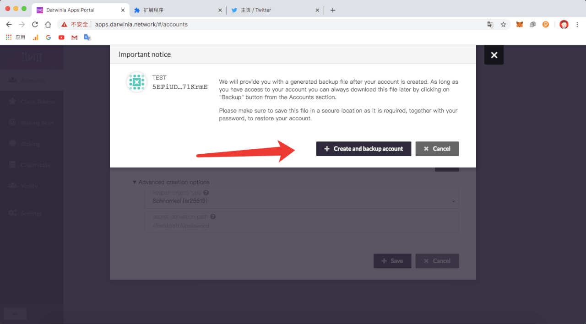
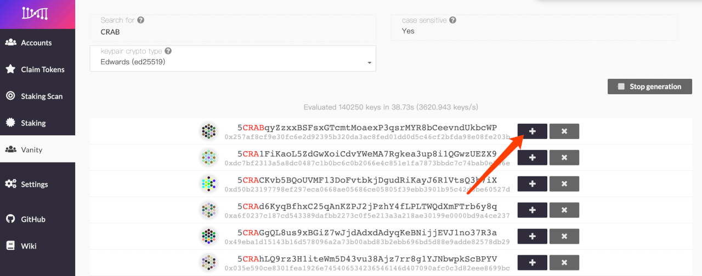
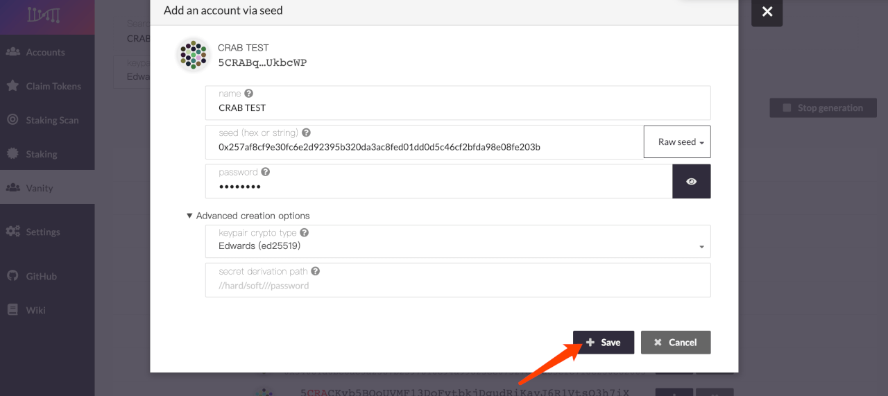
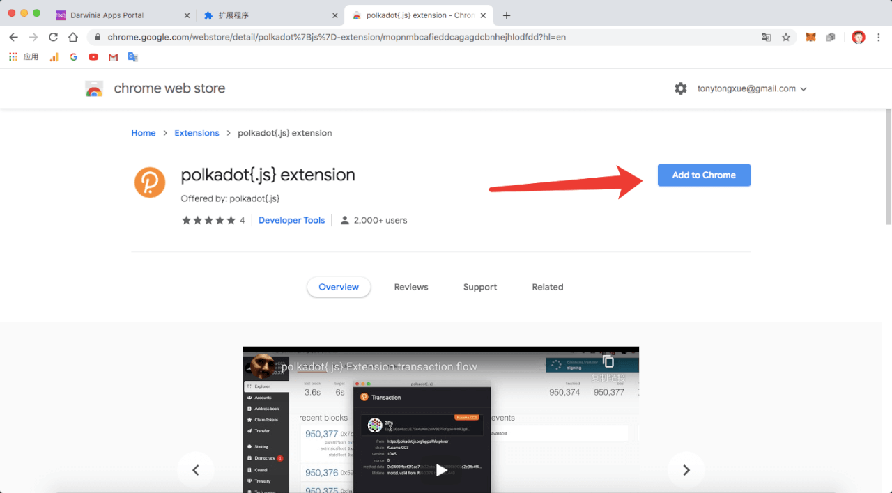
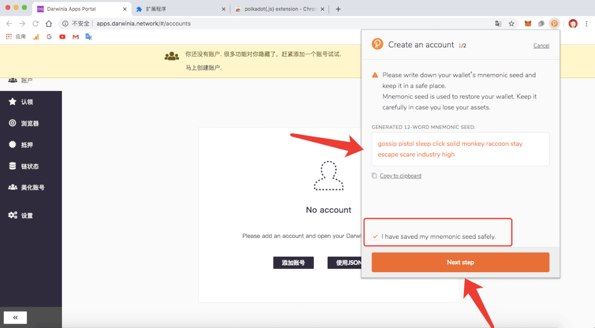

## Switch Network

Firstly, Enter [Darwinia Crab Web Wallet](https://apps.darwinia.network) and click "Setting" in the left-up corner to select the Darwinia MainNetwork.

Please confirm that the "Account Prefix" has been set to "Darwinia" in "Setting". Under this precondition, all accounts in the wallet (including the existing account list) will be displayed in the form of Darwinia mainnet accounts.



## Generate a Darwinia account

There are several ways to create a Darwinia account as following:
  
  1. Via Darwinia Web Wallet
  2. Via the Polkadot.js browser plug-in
  3. Via the Subkey command line tool
    
You can choose one of them according to your preferences. If you have created an account before, you can directly restore/import the account through "Mnemonic/Raw seed/json file".

  <!--DOCUSAURUS_CODE_TABS-->
  <!--Darwinia Web Apps-->

### Darwinia Web Wallet

1. Enter [Darwinia Crab Web Wallet](https://apps.darwinia.network), you can see two buttons "Add Account" and "Restore  JSON" in the "Account" column.

2. New account

You can see two buttons "Add Account" and "Restore  JSON" in the "Account" column.



Click "Add Account", after setting the basic account information, click the "Save" button. (By default, only "mnemonic", "private key" need to be switched)


3. Click the "Create and Backup Account" button to back up the account "json file"



> Be sure to back up `mnemonics, private keys, json files`, etc. When backing up the json file, please keep the password safe. If the password is lost, the address cannot be restored through the json file, but it can be re-imported through the mnemonic word and private key.

4. Restore from json file

If you have created an account before and backed up a json file, you can directly select "Restore JSON".


5. Restore account via "Mnemonic"

If you forget the password of the JSON file, you can use the "mnemonic word" to recover it. Click "Add Account" to replace the mnemonic with the original account's mnemonic. (The name and password can be reset)


6. Generate Vanity account

If you need to generate a Darwinia wallet account containing specific letters, you can refer to the tutorial:
   >This type of account is mostly used to receive the airdrop proof of work from the faucet, or is in need of memory and beauty.

- Click [Vanity], fill in the conditions you need to filter

  

  - `Search for` Type here what you would like your address to contain. This tool will generate the keys and show the associated addresses that best match your search. You can use \"?\" as a wildcard for a character.": "",

  - `Case sensitive` Should the search be case sensitive, e.g if you select \"no\" your search for \"Some\" may return addresses containing \"somE\" or \"sOme\"...": "Should the search be case sensitive, e.g if you select \"no\" your search for \"Some\" may return addresses containing \"somE\" or \"sOme\".

  - `Keypair crypto type` Determines what cryptography will be used to create this account. Note that to validate on Polkadot, the session account must use \"ed25519\".": "Determines what cryptography will be used to create this account. Note that to validate on Polkadot, the session account must use ed25519.

- Click [Start generation], after waiting for the account to be generated, click [+] to select your favorite account for backup.



- Click [Save], according to your usage habits, choose to back up the original seed or json file



> Be sure to back up `mnemonics, private keys, json files`, etc. When backing up the json file, please keep the password safe. If the password is lost, the address cannot be restored through the json file, but it can be re-imported through the mnemonic word and private key.


  <!--Polkadot.js Browser Plugin-->
### Polkadot.js Browser Plugin

1. Install the Browser Plugin, The browser plugin is available for both [Google Chrome](https://chrome.google.com/webstore/detail/polkadot%7Bjs%7D-extension/mopnmbcafieddcagagdcbnhejhlodfdd?hl=en) and [FireFox](https://addons.mozilla.org/en-US/firefox/addon/polkadot-js-extension).



2. New Account

Click the extension to open the "Account Management" dialog box, click the "Create New Account" button, and then follow the instructions.




> Make sure to keep the mnemonics safe.


  <!--Subkey CLI-->
### Subkey

Subkey is recommended for technically advanced users who are comfortable with command line and compiling Rust code. Subkey allows you to generate keys on any device that can compile the code. Subkey may also be useful for automated account generation, using an air-gapped device other than one running iOS or Android or other specific purposes. It is not recommended for general users.

To [install Subkey](https://substrate.dev/docs/en/ecosystem/subkey#more-subkey-to-explore), run:

```bash
$ curl https://getsubstrate.io -sSf | bash -s -- --fast
$ cargo install --force --git https://github.com/paritytech/substrate subkey
$ cargo build -p subkey
```

After installing Subkey successfully, run:

```shell
subkey -n substrate generate
Secret phrase `destroy vague trend estate person civil cattle lab hockey tooth error pigeon` is account:
  Network ID/version: substrate
  Secret seed:        0x58e57817a2ccfa696ed6c3735d4cc4646f894bf7daf51a94f0c4702a92e40710
  Public key (hex):   0x225ce1f9c178189d2a977a195f822ebbfb538b317f23f83ab35605fb009fa438
  Account ID:         0x225ce1f9c178189d2a977a195f822ebbfb538b317f23f83ab35605fb009fa438
  SS58 Address:       2owvscruh7PNbykGLMZPxHyjYdi1Ryanrm4PTxVKh85Ef8Dn
```

> If you previously created an account for other networks other than `substrate` or `crab network`, you need to derive the  correct `Address` from your previous  `secret phrase` or `secret seed`.  You can use `subkey -n substrate inspect "YOUR SECRET PHRASE HERE"` to obtain the Crab network-ID inclusive Address (SS58).

  <!--END_DOCUSAURUS_CODE_TABS-->

## Storing your key safely

> **DISCLAIMER: Key Security**
Your secret seed is the _only_ way to get access to your account. You must keep
the secret both secure and private. If you share you secret with anyone they
will be able to have full access to your account, including all of your funds.
The secret, for this reason, is a target from hackers and others with bad
intentions to steal your funds. We recommend a variety of account generation
methods that have various convienience and security tradeoffs. Please review
this page carefully before making your address so that you understand the risks
of the account generation method you choose and how to properly mitigate them
in order to keep your funds safe.

The seed is your **key** to the account. Knowing the seed allows you, or anyone
else who knows the seed, to re-generate and control this account.

It is imperative to store the seed somewhere safe, secret, and secure. If
you lose access to your account, you can re-create it by entering the seed. This
also means that somebody else can have control over your account if they have
access to your seed.

For maximum security, the seed should be written down on paper or another non-digital device and stored in a
safe place. You may also want to protect your seed from physical damage, as well (e.g. by storing in a sealed
plastic bag to prevent water damage, storing it in a fireproof safe, etc.) It is recommended that you store
multiple copies of the seed in geographically separate locations (e.g., one in your home safe and one in a
safety deposit box at your bank).

You should definitely not store your seed on any kind of computer that has or may have access to the internet
in the future.