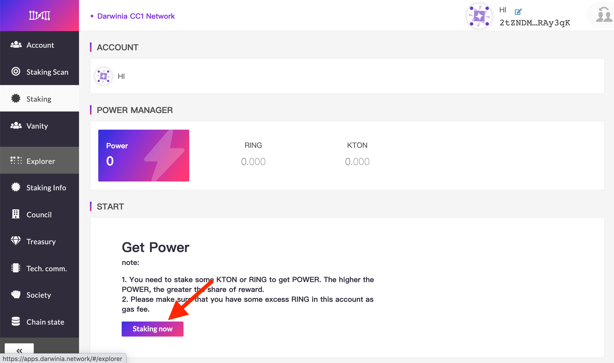
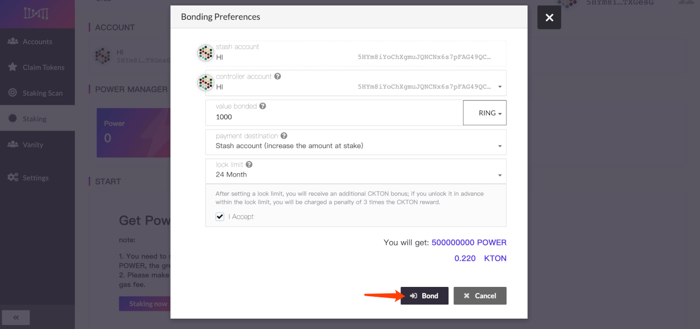
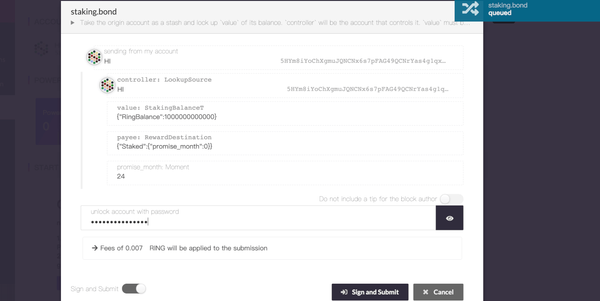
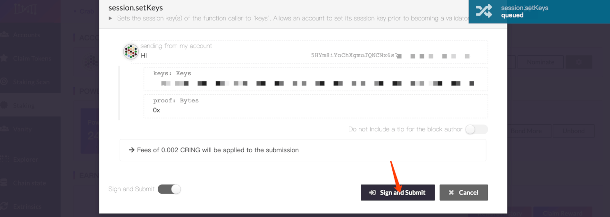
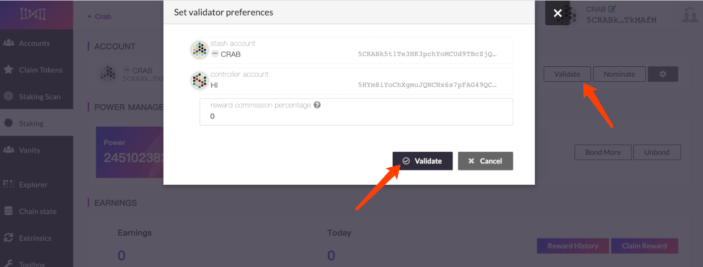

> - Staking is a consensus mechanism based on PoS (Proof of Stake / Proof of Stake). Token holders obtain rewards and benefits through pledge, voting, delegation, and locking.

> - A small amount of RING must be prepared in Darwinia Network's address as fee.

This article will help you run a validator node from scratch and become a validator.

## Run your validator node in rpc unsafe

```bash
docker run -it -v <DIR>:/data -p 30333:30333 -p 9933:9933 darwinianetwork/darwinia:v0.x.x-x.x --name <NAME> --base-path /data --validator  --unsafe-rpc-external --rpc-methods=Unsafe
```

## Generate your session key

Run the command on the shell where your validator node is running:

```json
curl http://127.0.0.1:9933 -H "Content-Type:application/json;charset=utf-8" -d \
'{
  "jsonrpc":"2.0",
  "id":1,
  "method":"author_rotateKeys",
  "params": []
}'
```

If there is no problem, a result similar to the following will be returned:

```json
{"jsonrpc":"2.0","result":"0xba99ecfb4a87357a44ee2765cf617a6d81adf8f43e522db52e348d2f9d45ccde12d53d562e14bb18522fbc3032b786f44b2b92240f4756386d4baec68bbfb882bbabcce1440c84d7f5b67c8ecb956345100d5dbd07adfeba3d9482f95d9dec6c68d085323e61590f850c38244dd2c2bc4055548d9edfd0471f47da7667c17fe8","id":1}
```

The result is what you need when setting the session key.

There is another way to generate session key via web wallet, [click to view](click to view).

## Staking

### Entrance
- Enter [Darwinia Wallet](https://apps.darwinia.network) and click the [Staking] column on the left , Click [Start staking].




### Fill in the staking parameters



- ` Stash account` Account for stashing tokens. Tokens participating in staking will come from this account. The operations of this account are mostly related to changes in stash.

- `Controller account`  The controller is the account that will be used to control any nominating or validating actions. Should not match another stash or controller.

    > The `Stash account` and ` Controller account` can be set to the same account. If you hold more tokens or have higher security requirements, it is recommended to set up different accounts here.

- `Value bonded` The total amount of the stash balance that will be at stake in any forthcoming rounds (should be less than the total amount available).  This part of the tokens will be temporarily bonded. bonding takes 14 days to unbond; you can choose to bond RING or KTON.

- `Payment destination` The destination account for any payment as either a nominator or validator.

- `Bond period` Optional; bond RING promise for 1-36 months to get additional KTON rewards. (Promise to lock to accept user terms)

    > If you unlock RING in advance within the lock limit, you will be charged a penalty of 3 times the KTON reward (In the absence of sufficient KTON, the RING can not be used for payment of fines).

- After filling in the staking parameters, please click [bond] and [submit]



### Set session key

Click [Set session key] on this page, completing the generated session key and submit. 
   > The session key must be filled with real data, otherwise it will result in missing blocks and be slashed.


**After confirming, click [sign and submit]** 

   > The identities of the validator and the nominator are mutually exclusive and cannot coexist. If you are running a validator, you need to cancel the validator before proceeding with the nomination.




**Click [validate] and set the validator parameters**

- `Reward commission percentage` Set the proportion of the node's priority distribution of income, the range is 0-100. (Example: If a 5% reward commission is set, this node will first receive 5% of the node's revenue, and the remaining 95% of the node's revenue will be distributed in proportion to the amount of mortgages validated by the validator and nominator; Validator's income = node reward commission + mortgage reward share)




**After confirming, click [sign and submit]】** 


**Go to [staking scan] to view information about validators**


   > The operation of validate will take effect after the first epoch of the next era (about 24 hours). Prior to this, the validator will be in the [waiting] list.

## (Optional) Rerun your validator node

For security, you need to remove the rpc unsafe parameters and re-run your node:

```bash
docker run -it -v <DIR>:/data -p 30333:30333 darwinianetwork/darwinia:v0.x.x-x.x --name <NAME> --base-path /data --validator
```


## Other operations

There are other operations in staking for the following purposes:

- `Stop validate` Leave the validator queue.

- `Bond` &`Bond more` Adds bonded tokens for staking to obtain more power.

- `Unbond` Unbond tokens for staking, and at the same time the power will be reduced proportionally.

  > The 14-day bond period is required to unbond. Tokens that are in the bond period cannot be operated. Please be careful.

- `Reward history` Go to SUBSCAN explorer to view historical reward records

- `Claim reward` Manually claim the reward, and the reward will be distributed in units of era.

  > Please note: after 56 era (about 56 days), you will not be able to claim it.

- `Change controller account` Change the account  that will be used to control any nominating or validating actions. Should not match another stash or controller.
- `Change reward destination` Change the destination account for any payment as either a nominator or validator.
- `Set on-chain identity` Set your personal information, such as display, legal name, email, website, twitter and riot. Other users can view this information and contact you.


